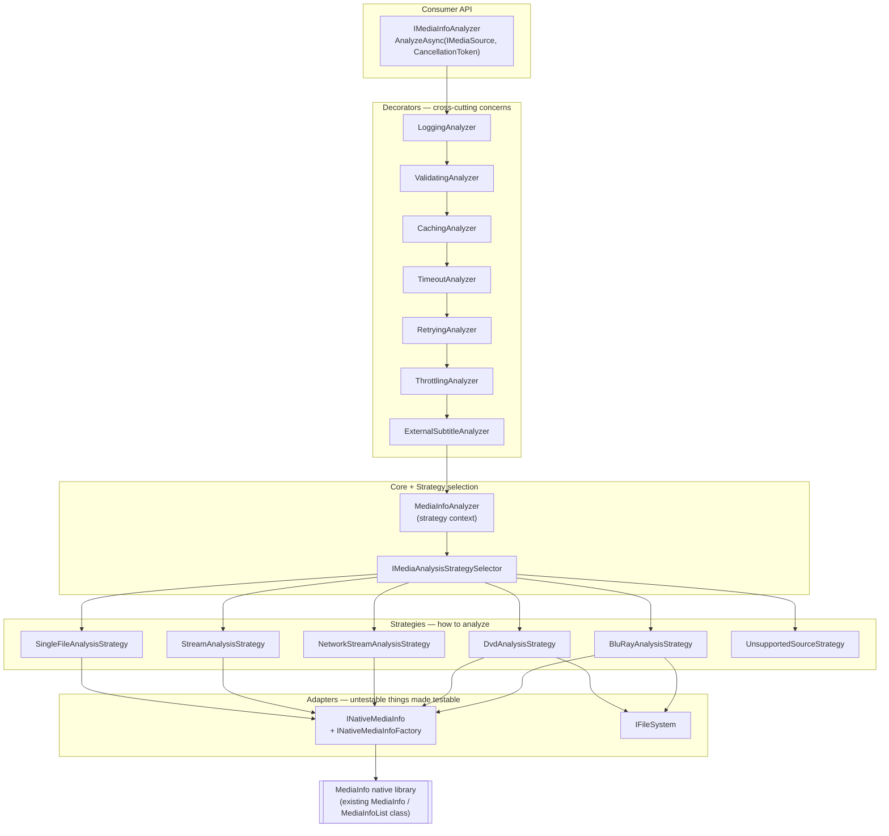

# Async Media Analyzer — Design & Delivery Plan

> Status: **phases 0–4 implemented** · Target: MP-MediaInfo v27 · Namespace: `MediaInfo.Analysis`
> Supersedes (without removing): `MediaInfo.MediaInfoWrapper`
>
> **Implemented:** adapters, result model, sources, file/stream/network strategies, disc structure readers and
> DVD/Blu-ray strategies. 69 unit tests and 34 integration tests pass with nothing skipped — including the DVD path,
> now covered against a real disc. The existing wrapper suite is unchanged (227 passed / 1 skipped, identical to
> `HEAD` before the change).
> **Not yet implemented:** decorators and the builder (phase 5), the legacy adapter (phase 6), samples and the
> `[Obsolete]` marking (phase 7), binary IFO/MPLS parsers (phase 8). `MediaAnalysisResult.HasExternalSubtitles` is
> therefore always `false` until the phase 5 decorator lands.

---

## 1. Why replace `MediaInfoWrapper`

`MediaInfo.Wrapper/MediaInfoWrapper.cs` is 1394 lines and carries the whole feature set in one class. The concrete problems this design addresses:

| # | Problem | Where |
|---|---|---|
| 1 | **All work happens in the constructor.** Cannot be `await`ed, cancelled, retried, or timed out. Failures are swallowed into `Success = false`. | `MediaInfoWrapper(string, ILogger)`, `MediaInfoWrapper(Stream, ILogger)` |
| 2 | **Blocking I/O in the stream path.** `stream.Read(...)` inside `ParseStreamWithSeek` / `ParseStreamWithoutSeek` blocks a thread per file. | `MediaInfoWrapper.cs:363`, `:400` |
| 3 | **Not unit-testable.** `new MediaInfo(...)` is constructed inside private methods; there is no seam. Every test needs the native library *and* a real media file. | `ParseMedia`, `ProcessBupFile` |
| 4 | **One class, nine responsibilities**: path classification, DVD walk, BD detection, external-subtitle scan, native open, buffer pumping, stream building, "best stream" heuristics, logging, plus ~40 flattened convenience properties. | whole file |
| 5 | **Shallow disc support.** DVD = "scan `*.BUP`, take the longest". Blu-ray = "set `IsBluRay = true`, point at the folder, sum directory size". No titles, playlists, chapters, angles, or clip mapping is exposed. | `ProcessDvd`, `ProcessBupFile`, ctor BD branch |
| 6 | **Mutable god-object result.** 40+ `{ get; private set; }` properties on the same object that performs the work. Cannot be cached, snapshotted, or safely shared. | `#region public … properties` |
| 7 | **`MediaInfoList` is wrapped but never used** — the native multi-file API that disc handling actually wants. | `MediaInfo.cs:558` |
| 8 | Reported native/managed leak under repeated use. | [issue #52](https://github.com/yartat/MP-MediaInfo/issues/52), `GeneratedFilesIntegrationTests` |

---

## 2. Locked scope decisions

| Decision | Choice | Consequence |
|---|---|---|
| **Compatibility** | New API alongside legacy; `MediaInfoWrapper` marked `[Obsolete]` with a migration message. | No breaking change for current consumers. Deprecation signalled for a future major. |
| **Target frameworks** | **.NET / Core only** — new code compiles for `netstandard2.1;net6.0;net8.0;net10.0` (i.e. `MediaInfo.Wrapper.Core.csproj` only). | Zero `#if` in the new layer. `Span<T>`, `ValueTask`, `IAsyncEnumerable<T>`, `Stream.ReadAsync(Memory<byte>, …)` and nullable reference types are all available on every target. |
| **Samples** | Console sample + batch folder-scan sample + `ApiSample` migration. | Three deliverables in `Samples/`. |

### 2.1 Two mechanical consequences of the TFM decision

1. `MediaInfo.Wrapper.csproj` (net4.0/net4.5/net481) has **no `<Compile Remove>` items today** — it globs the whole `MediaInfo.Wrapper/` folder. The new code must be explicitly excluded there:

   ```xml
   <!-- MediaInfo.Wrapper/MediaInfo.Wrapper.csproj -->
   <ItemGroup>
     <Compile Remove="Analysis\**\*.cs" />
   </ItemGroup>
   ```

   (`MediaInfo.Wrapper.Core.csproj` already uses this mechanism for `ILogger.cs` and `Extensions\LogExtensions.cs`.)

2. The `[Obsolete]` attribute on `MediaInfoWrapper` must be guarded, because .NET Framework consumers have **no replacement to migrate to**. Warning them would be wrong:

   ```csharp
   #if !NETFRAMEWORK
   [Obsolete("Use MediaInfo.Analysis.IMediaInfoAnalyzer. See docs/architecture/async-media-analyzer.md.", error: false)]
   #endif
   public class MediaInfoWrapper { … }
   ```

---

## 3. Architecture

Five layers. Each boundary is an interface, and every interface is the seam a test substitutes at.



### 3.1 Layer 0 — Adapters

**`INativeMediaInfo`** is the single most important addition: it is the seam that makes everything above it unit-testable without the native library.

```csharp
namespace MediaInfo.Analysis.Native;

/// <summary>Testable abstraction over one MediaInfoLib handle.</summary>
public interface INativeMediaInfo : IDisposable
{
    bool Open(string fileName);
    void OpenBufferInit(long fileSize, long fileOffset);
    MediaInfoBufferStatus OpenBufferContinue(ReadOnlySpan<byte> buffer);
    long OpenBufferContinueGoToGet();
    void OpenBufferFinalize();
    void Close();

    string Get(StreamKind kind, int number, string parameter);
    string Get(StreamKind kind, int number, int parameter, InfoKind infoKind = InfoKind.Text);
    int CountGet(StreamKind kind);
    string Option(string name, string value = "");
    string Inform();
    string? LibraryVersion { get; }
}

[Flags]
public enum MediaInfoBufferStatus
{
    None = 0, Accepted = 1, Filled = 2, Updated = 4, Finalized = 8
}

public interface INativeMediaInfoFactory
{
    INativeMediaInfo Create();
}
```

* `MediaInfoLibAdapter : INativeMediaInfo` — **Adapter**. Wraps the *existing* `MediaInfo` class. No P/Invoke is rewritten or duplicated; `IntPtr` returns become `bool`/enum, and the `& 8` magic number becomes `MediaInfoBufferStatus.Finalized`.
* `MediaInfoLibFactory : INativeMediaInfoFactory` — owns construction, applies the `setlocale_LC_CTYPE = C.UTF-8` fix for non-Windows (currently duplicated inline in `ParseMedia`).

**`IFileSystem`** — a deliberately tiny (6-member) internal abstraction so disc-structure logic is testable without touching a real disk:

```csharp
internal interface IFileSystem
{
    bool FileExists(string path);
    bool DirectoryExists(string path);
    string[] GetFiles(string path, string searchPattern, SearchOption option);
    string[] GetDirectories(string path);
    long GetFileLength(string path);
    Stream OpenRead(string path);
}
```

> Chosen over `System.IO.Abstractions` to keep the NuGet package dependency-free, matching the repo's existing minimal-dependency posture (`Microsoft.Extensions.Logging.Abstractions` + `MediaInfo.Core.Native` only).

### 3.2 Layer 1 — Sources

Sources are **data**, not behaviour. They say *what* to analyze; strategies decide *how*.

```csharp
public interface IMediaSource
{
    MediaSourceKind Kind { get; }   // File | Stream | Directory | Network
    string DisplayName { get; }
}

public sealed class FileMediaSource(string path)      : IMediaSource;
public sealed class StreamMediaSource(Stream stream, bool leaveOpen = true) : IMediaSource;
public sealed class DirectoryMediaSource(string path) : IMediaSource;  // VIDEO_TS / BDMV roots
public sealed class NetworkMediaSource(Uri uri)       : IMediaSource;
```

`MediaSource.From(string pathOrUri)` performs the classification currently inlined in the wrapper constructor, reusing the existing, already-tested `FileNameExtensions` helpers (`IsDvD`, `IsBluRay`, `IsAvStream`, `IsRtsp`, `IsRtmp`, `IsMms`, `IsLiveTv`, `IsLastFmStream`).

### 3.3 Layer 2 — Strategies

```csharp
public interface IMediaAnalysisStrategy
{
    int Priority { get; }                       // lower wins
    bool CanHandle(IMediaSource source);
    Task<MediaAnalysisResult> AnalyzeAsync(
        IMediaSource source,
        MediaAnalysisContext context,
        CancellationToken cancellationToken);
}
```

| Strategy | Priority | Handles | Notes |
|---|---|---|---|
| `UnsupportedSourceStrategy` | 0 | rtsp / rtmp / mms | Fails fast with a typed reason. Preserves today's behaviour, but as an explicit `AnalysisFailure` instead of a silent `Success = false`. |
| `DvdAnalysisStrategy` | 10 | directory containing `VIDEO_TS` | Builds a `DvdStructure`, picks the main title, analyzes it. |
| `BluRayAnalysisStrategy` | 11 | directory containing `BDMV` | Builds a `BluRayStructure`, picks the main playlist, analyzes it. |
| `NetworkStreamAnalysisStrategy` | 20 | http/https URIs | Hands the URL straight to the native `Open`. |
| `SingleFileAnalysisStrategy` | 30 | any existing file | The common path. |
| `StreamAnalysisStrategy` | 30 | `StreamMediaSource` | Async buffer pump; seekable and non-seekable variants. |

Selection is a plain ordered scan — `PriorityStrategySelector(IEnumerable<IMediaAnalysisStrategy>)`. Adding a format means registering one more strategy; nothing existing is edited.

**A second, orthogonal strategy axis** replaces the hard-coded heuristic in `SetupProperties`:

```csharp
public interface IStreamSelectionStrategy
{
    VideoStream? SelectBestVideo(IReadOnlyList<VideoStream> streams);
    AudioStream? SelectBestAudio(IReadOnlyList<AudioStream> streams);
}
```

* `DefaultStreamSelectionStrategy` — today's formula, extracted verbatim so parity tests can prove it unchanged.
* `HighestBitrateStreamSelectionStrategy` — simpler alternative.
* `PreferredLanguageSelectionStrategy(inner, "eng", "rus")` — a **decorator over another selection strategy**: filter by language, delegate the ranking to the inner strategy, fall back to the full set when nothing matches.

### 3.4 Layer 3 — Decorators

All implement `IMediaInfoAnalyzer` and wrap another `IMediaInfoAnalyzer`. Every one of them removes code that is currently tangled into the wrapper constructor.

| Decorator | Replaces / adds |
|---|---|
| `ValidatingAnalyzer` | The null/empty/`File.Exists` checks scattered through the ctor. |
| `LoggingAnalyzer` | Every `LogDebug`/`LogWarning` call in the core — ~40 call sites move out. |
| `CachingAnalyzer` | New. Keyed on path + size + last-write-time via a pluggable `IAnalysisCache`. |
| `TimeoutAnalyzer` | New. Linked `CancellationTokenSource`. |
| `RetryingAnalyzer` | New. Transient network-source failures. |
| `ThrottlingAnalyzer` | New. `SemaphoreSlim` bound — the native library plus buffered parsing is memory-hungry under parallel scans. |
| `ExternalSubtitleAnalyzer` | The `CheckHasExternalSubtitles` scan, currently unconditional inside the ctor. |
| `MetricsAnalyzer` *(optional)* | New. Timings/counters. |

**Recommended composition order** (outermost first) — configurable, but this is the default the builder emits:

```
Logging → Validation → Caching → Timeout → Retry → Throttling → ExternalSubtitles → MediaInfoAnalyzer
```

Rationale: logging sees everything including validation rejections; caching short-circuits before any budget is spent; the timeout is a *total latency budget*, so waiting on the throttle semaphore correctly counts against it; retry sits inside the timeout so retries share one budget rather than multiplying it.

Composition, fluent:

```csharp
var analyzer = MediaInfoAnalyzerBuilder.Create()
    .UseLogger(logger)
    .WithValidation()
    .WithCaching(TimeSpan.FromMinutes(10))
    .WithTimeout(TimeSpan.FromSeconds(30))
    .WithRetry(attempts: 3)
    .WithConcurrencyLimit(Environment.ProcessorCount)
    .WithExternalSubtitles()
    .Build();
```

Composition, DI:

```csharp
services
    .AddMediaInfoAnalyzer(options => options.BufferSize = 64 * 1024)
    .WithCaching()
    .WithConcurrencyLimit(4);
```

### 3.5 Layer 4 — Result model

Immutable `record`s. Analysis produces a value; it no longer *is* a mutable object.

```csharp
public sealed record MediaAnalysisResult
{
    public bool Success { get; init; }
    public AnalysisFailure? Failure { get; init; }

    public MediaSourceKind SourceKind { get; init; }
    public string? SourcePath { get; init; }
    public string? LibraryVersion { get; init; }
    public TimeSpan Elapsed { get; init; }

    public GeneralMediaInfo General { get; init; } = GeneralMediaInfo.Empty;

    public IReadOnlyList<VideoStream>    VideoStreams { get; init; } = [];
    public IReadOnlyList<AudioStream>    AudioStreams { get; init; } = [];
    public IReadOnlyList<SubtitleStream> Subtitles    { get; init; } = [];
    public IReadOnlyList<ChapterStream>  Chapters     { get; init; } = [];
    public IReadOnlyList<MenuStream>     MenuStreams  { get; init; } = [];

    public VideoStream? BestVideoStream { get; init; }
    public AudioStream? BestAudioStream { get; init; }

    public DiscStructure? Disc { get; init; }          // null for plain files
    public bool HasExternalSubtitles { get; init; }
}

public sealed record AnalysisFailure(AnalysisFailureReason Reason, string Message, Exception? Exception = null);

public enum AnalysisFailureReason
{
    None, SourceNotFound, SourceEmpty, UnsupportedSource,
    NativeLibraryUnavailable, NativeOpenFailed, NoStreamsFound,
    StreamNotReadable, Cancelled, Timeout, Unknown
}
```

The existing `MediaInfo.Model.*` stream types (`VideoStream`, `AudioStream`, `SubtitleStream`, `ChapterStream`, `MenuStream`, `AudioTags`, …) are **reused as-is**. No parallel model, no duplicated builders — the existing `MediaStreamBuilder<T>` hierarchy is retargeted from the concrete `MediaInfo` class onto `INativeMediaInfo`, which is a mechanical, behaviour-preserving change.

**Disc structure** — the genuinely new capability:

```csharp
public abstract record DiscStructure(DiscKind Kind, string RootPath, long TotalSize)
{
    public abstract IReadOnlyList<IDiscTitle> Titles { get; }
    public IDiscTitle? MainTitle => Titles.MaxBy(t => t.Duration);
}

public sealed record DvdStructure    : DiscStructure { public IReadOnlyList<DvdTitle> DvdTitles { get; init; } }
public sealed record BluRayStructure : DiscStructure { public IReadOnlyList<BluRayPlaylist> Playlists { get; init; } }

public sealed record DvdTitle(
    int TitleNumber, int VtsNumber, TimeSpan Duration,
    int AngleCount, IReadOnlyList<DiscChapter> Chapters,
    IReadOnlyList<string> VobFiles) : IDiscTitle;

public sealed record BluRayPlaylist(
    string FileName, TimeSpan Duration,
    IReadOnlyList<BluRayClip> Clips, bool IsMainMovie) : IDiscTitle;

public sealed record BluRayClip(string ClipId, string M2tsPath, TimeSpan Duration, long Size);
```

**Legacy adapter (second Adapter use):** `LegacyResultAdapter` projects a `MediaAnalysisResult` onto the ~40 flat properties of `MediaInfoWrapper` (`VideoCodec`, `Framerate`, `Width`, `Height`, `AspectRatio`, `ScanType`, `AudioChannelsFriendly`, …). Existing consumer code migrates by changing one construction site, not by rewriting property access.

---

## 4. Pattern usage — explicit mapping

| Pattern | Applied at | Why it is the right fit (not decoration for its own sake) |
|---|---|---|
| **Adapter** | `MediaInfoLibAdapter` over the existing `MediaInfo` P/Invoke class | The native class is `IntPtr`-based, non-virtual, and impossible to mock. The adapter converts an unmockable dependency into an injectable interface — this single change is what makes the other ~90% of the code unit-testable. |
| **Adapter** | `LegacyResultAdapter` : flat legacy surface over `MediaAnalysisResult` | Two incompatible shapes (immutable record vs. 40 mutable properties) must interoperate during migration. Textbook adapter. |
| **Adapter** | `MediaInfoFileSystem` : `IFileSystem` over `System.IO` | Same reason: static `File`/`Directory` are unmockable, and disc-structure logic is pure filesystem walking. |
| **Strategy** | `IMediaAnalysisStrategy` (file / stream / DVD / BD / network / unsupported) | The `if (isDvd) … else if (isBluRay) … else …` chain in the constructor is an algorithm-family selection. Extracting it removes the branching and makes new source kinds additive. |
| **Strategy** | `IDiscStructureReader` (filesystem-heuristic vs. binary IFO/MPLS parser) | Lets Stage A ship without binary parsers and Stage B swap in real parsing with no consumer change (see §6). |
| **Strategy** | `IStreamSelectionStrategy` (best video/audio) | The ranking formula is a genuine policy decision users have asked to override (language preference, bitrate-only, resolution-only). |
| **Decorator** | Eight `IMediaInfoAnalyzer` wrappers | Logging, caching, retry, timeout, throttling, validation and subtitle enrichment are all orthogonal to *how a media source is parsed*. Each is independently testable, and consumers pay only for what they compose. |
| **Decorator** | `PreferredLanguageSelectionStrategy` over `IStreamSelectionStrategy` | Language filtering composes with any ranking policy rather than multiplying implementations. |

---

## 5. Project & file layout

```
MediaInfo.Wrapper/
  Analysis/                                  ← new; excluded from the net4.x csproj
    IMediaInfoAnalyzer.cs
    MediaInfoAnalyzer.cs                     (strategy context)
    MediaInfoAnalyzerBuilder.cs
    MediaAnalysisOptions.cs
    MediaAnalysisContext.cs
    ServiceCollectionExtensions.cs           (AddMediaInfoAnalyzer)
    MediaInfoAnalyzerExtensions.cs           (AnalyzeFileAsync / StreamAsync / DiscAsync / FolderAsync)
    Native/
      INativeMediaInfo.cs
      INativeMediaInfoFactory.cs
      MediaInfoLibAdapter.cs
      MediaInfoLibFactory.cs
      MediaInfoBufferStatus.cs
    Abstractions/
      IFileSystem.cs
      MediaInfoFileSystem.cs
    Sources/
      IMediaSource.cs  MediaSourceKind.cs  MediaSource.cs
      FileMediaSource.cs  StreamMediaSource.cs
      DirectoryMediaSource.cs  NetworkMediaSource.cs
    Strategies/
      IMediaAnalysisStrategy.cs
      IMediaAnalysisStrategySelector.cs  PriorityStrategySelector.cs
      SingleFileAnalysisStrategy.cs
      StreamAnalysisStrategy.cs
      DvdAnalysisStrategy.cs
      BluRayAnalysisStrategy.cs
      NetworkStreamAnalysisStrategy.cs
      UnsupportedSourceStrategy.cs
      Selection/
        IStreamSelectionStrategy.cs
        DefaultStreamSelectionStrategy.cs
        HighestBitrateStreamSelectionStrategy.cs
        PreferredLanguageSelectionStrategy.cs
    Decorators/
      LoggingAnalyzer.cs        ValidatingAnalyzer.cs
      CachingAnalyzer.cs        IAnalysisCache.cs  MemoryAnalysisCache.cs
      TimeoutAnalyzer.cs        RetryingAnalyzer.cs
      ThrottlingAnalyzer.cs     ExternalSubtitleAnalyzer.cs
    Discs/
      IDiscStructureReader.cs
      DvdStructureReader.cs     BluRayStructureReader.cs
      Parsers/                  (Stage B — IfoParser.cs, MplsParser.cs)
    Results/
      MediaAnalysisResult.cs    GeneralMediaInfo.cs
      AnalysisFailure.cs        AnalysisProgress.cs
      DiscStructure.cs          DvdStructure.cs  BluRayStructure.cs
      LegacyResultAdapter.cs
    Pipeline/
      MediaStreamCollector.cs   (drives the existing MediaStreamBuilder<T> set)

MediaInfo.Analysis.Tests/              ← new: unit, net10.0, NO native dependency
MediaInfo.Analysis.IntegrationTests/   ← new: integration, net10.0, native + real media
Samples/AnalyzerSample/                ← new console sample
Samples/BatchSample/                   ← new folder-scan sample
Samples/ApiSample/                     ← migrated to IMediaInfoAnalyzer
docs/architecture/async-media-analyzer.md
```

Both `.slnx` files gain the new projects; only `MP-MediaInfo.Core.slnx` gains the analysis projects (they do not build on net4.x).

---

## 6. Disc processing — staged, because binary parsing is the main risk

Real DVD title structure lives in `VIDEO_TS/*.IFO` (VMG/VTS program-chain tables); real Blu-ray title structure lives in `BDMV/PLAYLIST/*.mpls`. Both are binary formats. Writing correct parsers is roughly 400–700 LOC each and is by far the largest uncertainty in this plan. It is therefore split:

### Stage A — filesystem + MediaInfoLib, no binary parsing (Phase 4)

* **DVD**: enumerate `VTS_nn_m.VOB`, group by title set `nn`, order by part `m`. Query each title set's first VOB through `INativeMediaInfo` for duration/streams. Main title = largest total byte size (more reliable than today's `*.BUP` max-duration heuristic, which misses multi-VOB titles). Chapters/angles left empty and documented as Stage B.
* **Blu-ray**: enumerate `BDMV/STREAM/*.m2ts`, query each clip's duration/size via MediaInfo, list `BDMV/PLAYLIST/*.mpls` by name. Main title = longest clip. Playlist→clip mapping left empty and documented as Stage B.

This already ships more than the current implementation exposes, and it does so with logic that is entirely testable against a fake `IFileSystem`.

### Stage B — binary parsers (Phase 8, optional)

`IfoDvdStructureReader` and `MplsBluRayStructureReader` implement the same `IDiscStructureReader`, are registered ahead of the Stage A readers, and give true titles, chapters, angles and playlist→clip mapping. Because the interface is unchanged, this is a registration swap — no consumer edits, no strategy edits.

---

## 7. Async & cancellation — what is real and what is not

Being precise here matters, because it is easy to promise more than MediaInfoLib delivers.

| Path | Genuinely async? | Cancellable? |
|---|---|---|
| `StreamAnalysisStrategy` | **Yes.** `stream.ReadAsync(Memory<byte>, ct)` per 64 KB chunk; the native `OpenBufferContinue` call between reads is fast and synchronous. | **Yes**, at chunk granularity. |
| `SingleFileAnalysisStrategy` | **No.** Native `Open(path)` reads the file itself and blocks. | **No, mid-call.** The token is honoured *before* the call and at the next `await`. |
| `NetworkStreamAnalysisStrategy` | **No** — native library owns the socket. | **No, mid-call.** |
| Disc structure walk | Filesystem enumeration; async only where it awaits per-file analysis. | **Yes**, between files. |
| Folder scan (`AnalyzeFolderAsync`) | `IAsyncEnumerable<MediaAnalysisResult>` | **Yes**, between files. |

`MediaAnalysisOptions.OffloadBlockingCalls` (default `true`) wraps the blocking native calls in `Task.Run` so callers' threads are not held. This is documented explicitly as *thread offload, not cancellation* — an abandoned `Task.Run` still runs the native call to completion.

**Threading contract**: one `INativeMediaInfo` handle per analysis, never shared, always disposed in a `finally`/`using`. MediaInfoLib handles are not thread-safe. `ThrottlingAnalyzer` bounds how many exist at once.

**Progress**: `IProgress<AnalysisProgress>` (`BytesProcessed`, `TotalBytes`, `Phase`) is reported from the stream pump and per file during folder/disc scans.

---

## 8. Testing strategy

### 8.1 Unit tests — `MediaInfo.Analysis.Tests`

No native library, no media files, runs on any OS/architecture in CI. Everything is reachable because of the Layer 0 adapters. Uses the repo's existing stack: xUnit + Moq + FluentAssertions.

| Target | What is asserted |
|---|---|
| `MediaInfoLibAdapter` | `IntPtr`→`bool` mapping; `& 8` → `MediaInfoBufferStatus.Finalized`; `Dispose` closes the handle exactly once. |
| `StreamAnalysisStrategy` | Seekable vs. non-seekable pumping; short reads; zero-length streams; a stream that never finalizes; `OpenBufferContinueGoToGet` seek-back; cancellation mid-pump throws `OperationCanceledException`; `leaveOpen` honoured. |
| `PriorityStrategySelector` | Ordering, first-match-wins, no-match failure. |
| `MediaSource.From` | Classification of DVD folder, BD folder, file, http, rtsp/rtmp/mms, live-TV `.ts`, empty/null. |
| Each decorator, in isolation, over a stub analyzer | Caching hit/miss/invalidation on mtime change; retry count and give-up; timeout produces `AnalysisFailureReason.Timeout`; throttle never exceeds N concurrent; validation short-circuits without touching the inner analyzer; logging does not alter the result. |
| Decorator **composition** | The default order produces the documented call sequence (verified with an ordered spy). |
| `DvdStructureReader` / `BluRayStructureReader` | Against a fake `IFileSystem`: multi-VOB title grouping, title-set ordering, main-title selection, missing/partial folders, empty `STREAM/`. |
| `IStreamSelectionStrategy` implementations | The default formula reproduces the legacy ranking on hand-built stream lists; language decorator falls back correctly. |
| `LegacyResultAdapter` | Every legacy property maps to the correct result field, including empty-string defaults on failure. |

### 8.2 Integration tests — `MediaInfo.Analysis.IntegrationTests`

Real native library, **real media already in the repository**. The existing corpus is linked rather than copied, so the files stay committed exactly once:

```xml
<ItemGroup>
  <Content Include="..\MediaInfo.Wrapper.Tests\Data\*.*"
           Link="Data\%(Filename)%(Extension)"
           CopyToOutputDirectory="PreserveNewest" />
</ItemGroup>
```

Available corpus:

| File | Exercises |
|---|---|
| `Test_H264.m2ts`, `Test_H264_AC3.m2ts`, `Test_H264_DTS1.m2ts`, `Test_H264_DTS2.m2ts`, `Test_H264_Atmos.m2ts` | H.264 video; AC-3 / DTS / Dolby Atmos audio; **and, being real BD transport streams, the building blocks for a synthetic BDMV fixture** |
| `Test_MP3Tags.mp3`, `Test_MP3Tags_2.mp3`, `Test_MP3Tags.mka` | Audio + tag extraction, Matroska container |
| `RTL_7_Darts_WK_2014-2013-12-23_1_h263.3gp` | H.263 / 3GP |
| `./TestAudio/*` + `manifest.csv` (from `MediaInfo.TestFilesGenerator`) | Bulk correctness and the issue #52 leak guard |

Test groups:

1. **Single file** — every `Data/` file analyzed via `AnalyzeFileAsync`; assert `Success`, stream counts, codecs, container.
2. **Stream** — the same files opened as `FileStream` and as a non-seekable wrapper; assert results match the file path result for the fields a buffer parse can determine.
3. **Parity suite** *(the key safety net)* — for each file, run legacy `MediaInfoWrapper` **and** the new analyzer, then assert equality field-by-field on the shared surface (`Success`, `Duration`, `Size`, `Format`, `VideoCodec`, `Framerate`, `Width`, `Height`, `AspectRatio`, `ScanType`, `AudioCodec`, `AudioChannels`, `AudioChannelsFriendly`, stream counts). This is what proves the rewrite is faithful rather than merely green.
4. **Blu-ray (genuine)** — an `xUnit` fixture builds a temp `BDMV/{STREAM,PLAYLIST,CLIPINF}` tree and copies `Test_H264*.m2ts` into `STREAM/0000n.m2ts`. Because these are real m2ts streams, MediaInfoLib parses them for real: structure discovery, clip durations, main-title selection and the analyze-main-title leg are all exercised end to end.
5. **DVD (covered against a real disc)** — a DVD structure is several gigabytes and cannot be committed, so it lives beside the repository in the shared sample collection, exactly as the large audio and high-definition samples of the existing wrapper tests already do. `TestMedia.FindDvd()` consults three locations in order and `[DvdFact]` skips with an explanatory message when none of them yields a disc:

   1. `MediaInfo.Wrapper.Tests/Data/VIDEO_TS` — a sample small enough to commit, should one ever exist.
   2. The folder named by the `MP_MEDIAINFO_DVD_PATH` environment variable, which may point at either the disc folder or the `VIDEO_TS` folder inside it.
   3. Any disc under `../MP-MediaInfo.Samples/Video/*/VIDEO_TS`, relative to the test output — the convention `AudioTests` and `VideoTests` already use.

   Five tests run end to end against the disc: title-set discovery, VOB ordering and menu-VOB exclusion, total size, whole-title duration, and entry from an `.IFO` path rather than the folder.
6. **Resource leak** — the existing `GeneratedFilesIntegrationTests` thresholds (20 MB managed / 50 MB private) re-run against the new analyzer, guarding issue #52 for the new code path.
7. **Cancellation & timeout** — a deliberately slow stream proves the pump observes the token; the timeout decorator returns `AnalysisFailureReason.Timeout` rather than hanging.

Native access is serialized with an xUnit `[Collection]` so parallel test execution does not multiply native memory pressure.

---

## 9. Examples

### 9.1 `Samples/AnalyzerSample` (console)

```
AnalyzerSample file  <path>            # single media file
AnalyzerSample strm  <path>            # opened as a Stream, with a live progress bar
AnalyzerSample disc  <VIDEO_TS|BDMV>   # prints the full title/playlist tree
AnalyzerSample url   <http-url>        # network source
```

Demonstrates: DI wiring, builder composition, `IProgress<AnalysisProgress>`, Ctrl+C → `CancellationToken`, and reading `AnalysisFailure` instead of guessing from `Success == false`.

### 9.2 `Samples/BatchSample` (console)

Recursive folder scan over `IAsyncEnumerable<MediaAnalysisResult>` with the throttling and caching decorators enabled; writes CSV/JSON; shows how the decorator stack keeps memory bounded across thousands of files.

### 9.3 `Samples/ApiSample` (migrated)

`MediaController` moves from constructing `new MediaInfoWrapper(...)` per request to an injected `IMediaInfoAnalyzer`; actions become `async Task<IActionResult>` and forward `HttpContext.RequestAborted`. Mapster profiles are updated to map `MediaAnalysisResult` → the sample's DTOs, and a new `POST /media/disc` endpoint returns the disc structure.

---

## 10. Phased delivery

Each phase is independently mergeable and independently verifiable.

| Phase | Deliverable | Verification |
|---|---|---|
| **0** ✅ | Folder scaffolding, `<Compile Remove="Analysis\**\*.cs" />` in the net4.x csproj, `MediaInfo.Analysis.Tests` and `MediaInfo.Analysis.Integration.Tests` added to `MP-MediaInfo.Core.slnx`. `IAsyncEnumerable<T>` confirmed to need no extra package on netstandard2.1. | Both solutions build; net4.x builds with the analysis layer excluded. |
| **1** ✅ | `INativeMediaInfo`, `INativeMediaInfoFactory`, `MediaInfoLibAdapter`, `MediaInfoLibFactory`, `IFileSystem`, `MediaInfoFileSystem`. Plus `IMediaInfoReader` — see note below. | Integration tests open real media through the adapter. |
| **2** ✅ | Result model, `GeneralMediaInfo`, `DurationReader`, `MediaProbe`, `MediaStreamCollector` (existing builders retargeted to `IMediaInfoReader`), `IStreamSelectionStrategy` + default, highest-bitrate and preferred-language implementations. | Existing wrapper suite unchanged: 227 passed / 1 skipped, byte-identical to the pre-change baseline measured in a `HEAD` worktree. |
| **3** ✅ | `IMediaSource` set, `SingleFileAnalysisStrategy`, `StreamAnalysisStrategy`, `NetworkStreamAnalysisStrategy`, `UnsupportedSourceStrategy`, `PriorityStrategySelector`, core `MediaInfoAnalyzer`. | Pump unit tests (seekable, forward-only, short reads, empty, cancellation, `leaveOpen`); integration tests compare stream analysis against file analysis on every corpus file. |
| **4** ✅ | `IDiscStructureReader`, `DvdStructureReader`, `BluRayStructureReader`, `DvdAnalysisStrategy`, `BluRayAnalysisStrategy`, disc result records. | Fake-filesystem unit tests; a synthetic BDMV fixture built from the corpus `.m2ts` files is analyzed end to end by the real library. |
| **5** | Eight decorators, `IAnalysisCache`, `MediaInfoAnalyzerBuilder`, `AddMediaInfoAnalyzer`. | Per-decorator unit tests + composition-order test. |
| **6** | Full integration suite, leak guard on the new path, `LegacyResultAdapter`. | Whole suite green in Debug and Release; leak thresholds respected. |
| **7** | Three samples, README section, `[Obsolete]` on `MediaInfoWrapper` (guarded `#if !NETFRAMEWORK`). | Samples build and run against `Data/`; ApiSample Swagger loads; net4.x builds warning-free. |
| **8** *(optional)* | Stage B `IfoParser` / `MplsParser` readers. | Registration swap only; Stage A tests still pass; new parser unit tests against committed byte fixtures. |

### 10.1 One deviation from the plan: `IMediaInfoReader`

The plan had the stream builders retargeted onto `INativeMediaInfo`. That is not possible as written: the builders are
compiled into the .NET Framework package too, and `INativeMediaInfo` uses `ReadOnlySpan<byte>`, which net4.0 does not
have.

The builders were therefore retargeted onto a new, smaller **`MediaInfo.IMediaInfoReader`** — the read-only surface
(`Get`, `CountGet`, `Option`, `Inform`) with no buffer or pointer types in it. It compiles on every target framework,
`MediaInfo` implements it with no code change beyond the declaration, and `INativeMediaInfo` extends it. Both the
legacy wrapper and the new pipeline can drive the same builders, and the builders remain testable without the native
library.

### 10.2 What the real disc taught us

The first run against a real DVD — one title set, seven content VOBs, 7.47 GB of title over 8.01 GB of disc — corrected an
assumption baked into the code comments. **MediaInfoLib recognises a `VTS_nn_*` sequence and reports the joined title**,
so opening `VTS_01_1.VOB` returns the duration of the whole 4:12:22 title, not of that one gigabyte slice. The
information file is still probed first, but the reason is that it is the navigation table and a fraction of the size,
not that a VOB would answer differently. The comments in `DvdStructureReader` and `DiscAnalysisStrategy` and the
integration assertion were corrected to say so.

### 10.3 A defect found while implementing

A transport stream parsed without seeking makes the library extrapolate a length that does not fit in a `TimeSpan`,
which threw `OverflowException` out of `TimeSpan.FromMilliseconds`. `DurationReader` now treats any value that is not
positive, finite and within `TimeSpan.MaxValue` as unknown, and both the collector and the disc probe go through it.
Covered by `DurationReaderTests`.

---

## 11. Risks & open items

| Risk | Impact | Mitigation |
|---|---|---|
| Binary IFO/MPLS parsing is large and fiddly | Schedule | Staged (§6). Stage A ships useful disc support with zero binary parsing; Stage B is optional and additive. |
| **No DVD sample in the repository** | End-to-end DVD coverage is unit-level only | Fake-`IFileSystem` unit tests + env-var-gated real-disc test. **Open item: add a small redistributable VIDEO_TS fixture** (see below). |
| Behavioural drift from the legacy wrapper | Silent regressions for existing users | The parity suite (§8.2 #3) is a merge gate for Phase 3 onward. |
| Native leak (issue #52) reappearing | Runtime | Deterministic `using` per analysis; existing leak thresholds re-run against the new path in Phase 6. |
| MediaInfoLib handle thread-safety under parallel scans | Crashes / corrupt reads | One handle per analysis, never shared; `ThrottlingAnalyzer` bounds concurrency; native tests serialized by xUnit collection. |
| Decorator stack surprises users | Support burden | One documented default order with stated rationale; the builder emits it unless overridden. |
| `[Obsolete]` warning with no .NET Framework replacement | Annoyed net4.x users | Guarded with `#if !NETFRAMEWORK` (§2.1). |

**Open items needing a decision before Phase 4 / Phase 7:**

1. **DVD fixture** — ~~decide between committing a sample and an opt-in path~~ **both are wired up.** The DVD tests look for `MediaInfo.Wrapper.Tests/Data/VIDEO_TS` first and fall back to the folder named by `MP_MEDIAINFO_DVD_PATH`; they are skipped with an explanatory message when neither is present. Dropping a `VIDEO_TS` folder into `MediaInfo.Wrapper.Tests/Data` is all that is needed to enable them — the integration project already globs it into the test output. Still open: whether that sample should be committed to the repository or stay local.
2. **Cache default** — is an in-memory `MemoryAnalysisCache` in the core package acceptable, or should `IAnalysisCache` ship with no built-in implementation to keep the package free of caching policy?
3. **Package split** — this plan keeps everything inside `MediaInfo.Wrapper.Core`. If the analysis layer later grows its own dependencies, a separate `MediaInfo.Analysis` package becomes the better home; worth revisiting at Phase 5.
